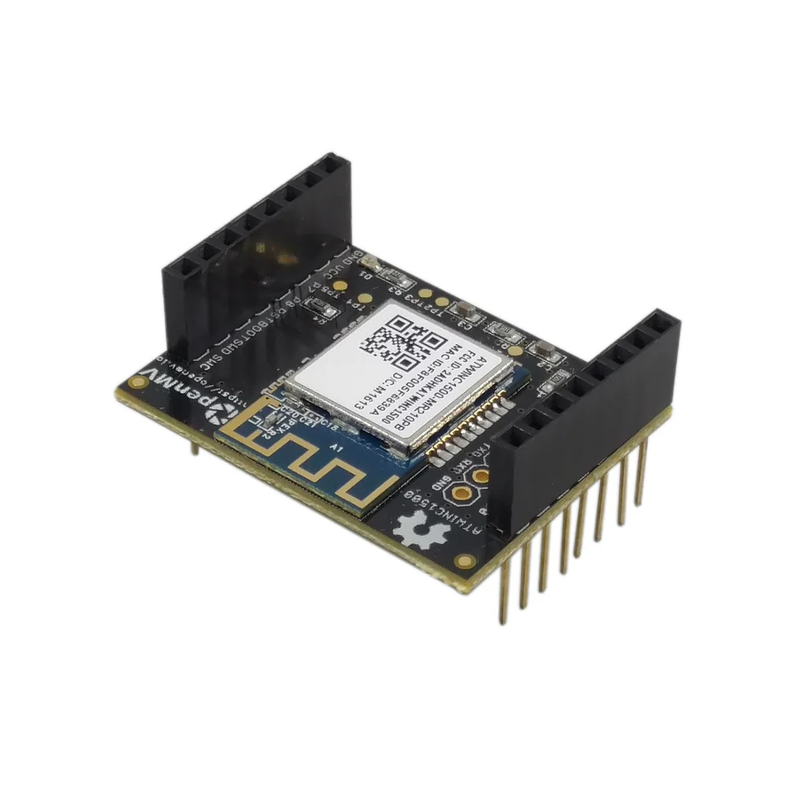

# 🏠 🚧 🚗  License Plate Gate

An IoT system that reads license plates of vehicles and activates gates.

## Table of Contents

- [🏠 🚧 🚗  License Plate Gate](#----license-plate-gate)
  - [Table of Contents](#table-of-contents)
  - [📜 Introduction](#-introduction)
  - [🔄 Logic Flow](#-logic-flow)
  - [💡 Hardware](#-hardware)
    - [📹 Edge Device](#-edge-device)
    - [💻 Server](#-server)
    - [🦾 Actuator](#-actuator)
  - [📀 Software](#-software)
    - [🎯 Visual Recognition](#-visual-recognition)
    - [⚙️ Configurations](#️-configurations)
      - [1. All on board (stand alone mode)](#1-all-on-board-stand-alone-mode)
      - [2. Simple database](#2-simple-database)
      - [3. Balanced configuration](#3-balanced-configuration)
      - [4. Lightweight camera](#4-lightweight-camera)
    - [🛜 Connection](#-connection)
    - [🚨 Security](#-security)
    - [💾 Storage](#-storage)
    - [📈 Dashboard](#-dashboard)
  - [🛠 Installation](#-installation)
    - [Edge Device](#edge-device)
    - [Server](#server)
  - [🔮 Future implementations](#-future-implementations)

## 📜 Introduction

The goal of this project is to develop an IoT system that allows registered vehicles to open various types of gates, barriers, and automated doors without the usage of any type of remote control or user interaction. The system consists of four main components:

- **Edge Device**: Collects images from the field and send them through a network.
- **Lightweight Server**: Collects data, performs operations and publishes results.
- **Database**: Stores important data requested by the server.
- **Actuator Device**: Performs actions based on the results published by the server.

These components can be implemented on a **single device** (stand-alone configuration) or distributed across **multiple devices** (connected).

In other words, the system is designed to operate either in a stand-alone configuration or in a collaborative setup.

## 🔄 Logic Flow

The system operates through the following steps:

1. **Plate Detection**: Identify the vehicle's license plate from the camera acquisition.
2. **Character Recognition**: Recognize characters within the license plate.
3. **Data Transmission** (Connected Version Only): Establish a connection with the server and forward the data.
4. **Evaluation**: Determine if the record is present on the database.
5. **Actuation**: Perform actions based on the previous evaluation (for example open a gate).

## 💡 Hardware

### 📹 Edge Device

The edge device is the first element of the system. It must acquire data from the environment and perform Wi-Fi connections. In an online system, image recognition tasks can be handled server-side, therefore lower minimum specs are required.

A device with a good-quality camera and a connection can achieve good results. For this project, an OpenMV Cam H7 Plus with a connection extension board has been choosen.

### 💻 Server

The server can operate in two modes:

- **Database**: Performs simple operations to check license plate records.
- **Fog Device**: Analyzes images and performs operations.

### 🦾 Actuator

The actuator can be the same edge device or a separate solution with GPIOs and MQTT support. For this project the actuator has been merged with the edge-device.

## 📀 Software

### 🎯 Visual Recognition

License plate and character recognition are performed using machine learning models trained with different datasets:

- **Plate Detection Model**: it is a model trained to identify the presence of license plates in images, even if the captured area is wide.
- **Character Recognition Model**: it is a model trained to recognize characters within a defined plate area. T

The sources used to train the Plate Detection Model are avaiable in the `datasets` folders.

The Character Recognition Model relies on keras `OCR (Optical Character Recognition)` library.

### ⚙️ Configurations

Both edge-device ang server can be customized with the configuration files avaiable in the respective folders.

The software provided in this project allow to select different solutions based on the hardware constraints. There are four possible alternatives.

#### 1. All on board (stand alone mode)

In the stand alone mode, plate detection, characters recognition, record evaluation and actuation are performed on the edge-device.

**Key features**

➕ Configure a single device without a server.

➕ Connection is not critical.

➖ Higher hardware specs required.

➖ Database not accessible.

This flow can be selected setting the field `MODE = 0`;

#### 2. Simple database

In simple database, plate detection and characters recognition are performed on board, while record evaluation is left to the server-side.

**Key features**

➕ Database easily updatable.

➕ Perform actions with remote commands.

➖ Two devices required.

➖ Server has very poor tasks.

This flow can be selected setting the field `MODE = 1`;

#### 3. Balanced configuration

In the balanced configuration, plate detection is performed on board, while characters recognition and evaluation is performed by server-side.

**Key features**

➕ Better tasks and resources organization.

➕ Edge-device filters data for server, acting as a fog-device.

➖ Both devices need good specs to work correctly.

➖ The total evaluation time might increase.

This flow can be selected setting the field `MODE = 2`;

#### 4. Lightweight camera

On lightweight camera, image acquisition is the only task installed on the board, all the other operations are performed on the connected server.

**Key features**

➕ Low specs required for edge-device.

➕ Server can deliver results faster.

➖ Edge-device can't filter the images acquired.

➖ Connection must have large bandwidth.

This flow can be selected setting the field `MODE = 1`;

> **NOTE**: This configuration implements a much more simple code, that is suitable for low-specs hardware with micropython (like the openMV Cam H7)

### 🛜 Connection

Devices interact using MQTT protocol. A simple WLAN connection is sufficient for performing all the tasks included. For this project, a WIFI shield has been coupled with openMV Cam

### 🚨 Security

Devices connected to the server must be registered in the configuration file of the server, otherwise any message received by unknown devices will be dropped.

Server has a log feature that registers all actions performed and save them in a file.

The database is structured such that every attempt of access by cars will be stored in the plates table with time information.

### 💾 Storage

The database used for this project is based on InfluxDB. It has been choosen because it has all the basic features present in a common database plus a simple integration with python and other softwares.

### 📈 Dashboard

In order to allow a user to understand how the system is working, a simple but powerfull dashboard has been implement with the Grafana environment.

The interface shows the daily history of accesses, two quick links of last allowed and rejected car and statistics about cars accesses.

## 🛠 Installation

### Edge Device

You can find the `README.md` installation guide in the `src/server` folder .
  
### Server

You can find the `README.md` installation guide in the `src/server` folder .

## 🔮 Future implementations

Create a check system of devices with database records.

Integrate web GUI for server and edge device to edit the configurations.
